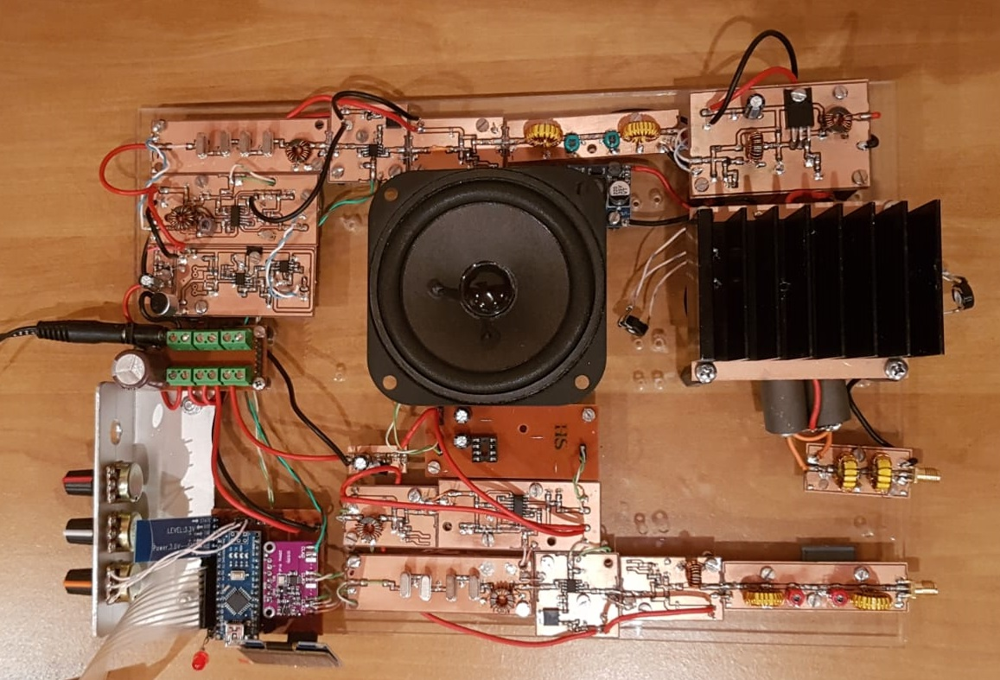
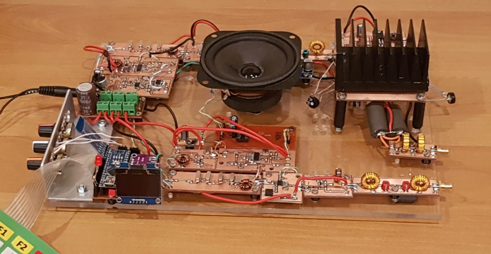

# 20m-SSB-TRX-Prototype-OE3SDE
Prototype on a 20m SSB TRX for ham radio by OE3SDE.

## Block Diagram

**Figure 1**: Block diagram of 20m SSB TRX.

## Frequency Spectrum

**Figure 2**: Frequency spectrum of 20m SSB TRX.

## Result

**Figure 3**: Result of 20m SSB TRX prototype.

**Figure 4**: Result of 20m SSB TRX prototype.